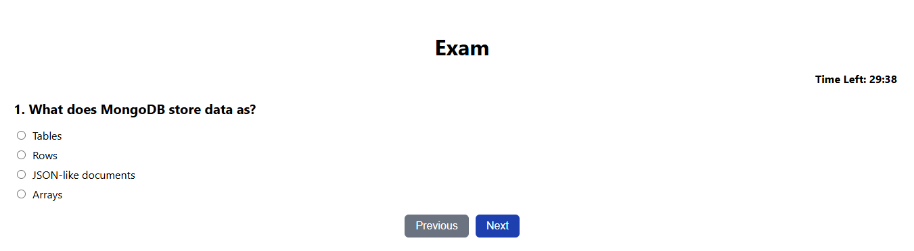
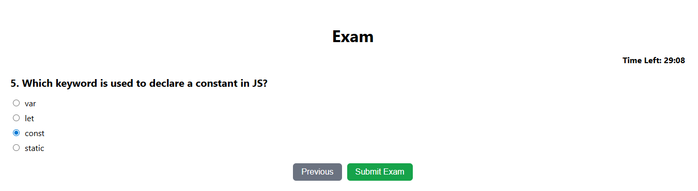

# Quiz Application (MERN Stack)

A full-stack quiz application focused on student-side exam module with user authentication, timer-based exams, and results tracking.  
Built using **React.js (frontend), Node.js + Express (backend), MongoDB (database).**

---

## Table of contents

- [Features](#Features)
- [Tech Stack](#TeckStack)
- [Project Structure](#ProjectStructure)
- [Setup Instructions](#SetupInstructions)
    - [Clone Repository](#CloneRepository)
    - [Backend Setup](#BackendSetup)
    - [Frontend Setup](#FrontendSetup)
- [API Testing](#APITesting)
-[screenShots](#screenShots)
- [Author](#author)

## Features
- User Registration & Login
- Timer-based Exams with Auto Submit
- Previous/Next Navigation
- Result Calculation
- Responsive UI with CSS

---

## Tech Stack

- **Frontend:** React.js, React Router, Axios  
- **Backend:** Node.js, Express.js  
- **Database:** MongoDB (Mongoose)  
- **Authentication:** JWT  
- **Styling:** CSS (responsive design)

---

## Project Structure

quiz-app/ \
|-- backend/ # Node.js + Express + MongoDB \
|-- frontend/ # React.js + CSS

---

## Setup Instructions

### 1 Clone Repository
```
git clone https://github.com/shrikanth-dev/Quiz-Application
cd quiz-app

```

### 2 Backend Setup

```bash

cd backend
npm install

```

# Create a .env file

```bash 

PORT=5000
MONGO_URI=mongodb+srv://<username>:<password>@cluster.mongodb.net/quiz
JWT_SECRET=yourSecretKey

``` 

### Seed database

run this to populate initial exam questions and test users

```bash

node seed.js

```

### Start backend server

```bash

npm start

```
**Note:** Make sure to run seed.js before starting the server if this is a fresh database. 

### 3 Frontend Setup

```bash

cd frontend
npm install
npm start
 
```
---

## API Testing


You can test the backend APIs using **curl commands**.

### Register User
```bash

curl -X POST http://localhost:5000/api/auth/register 
  -H "Content-Type: application/json" 
  -d '{"name":"Test User","email":"test@example.com","password":"123456"}'

  ```
  
### Login User

```bash
curl -X POST http://localhost:5000/api/auth/login 
  -H "Content-Type: application/json" 
  -d '{"email":"test@example.com","password":"123456"}'

```

**Note:** Note-down token received from Login which is an **JWT_TOKEN**

### Fetch Exam Questions

```bash

curl -X GET http://localhost:5000/api/exam/questions 
  -H "Authorization: Bearer <YOUR_JWT_TOKEN>"

```

### Submit Exam

```bash

curl -X POST http://localhost:5000/api/exam/submit 
  -H "Content-Type: application/json" 
  -H "Authorization: Bearer <YOUR_JWT_TOKEN>" 
  -d '{"answers":{"q1":1,"q2":0,"q3":2}}'

```
*Replace <YOUR_JWT_TOKEN> with the token received from login.*

### Screenshots






### Author

- Shrikanth Dev
- [GitHub](https://github.com/shrikanth-dev)
- Portfolio - [shrikanthdev-portfolio](https://shrikanthdev-portfolio.vercel.app/)


